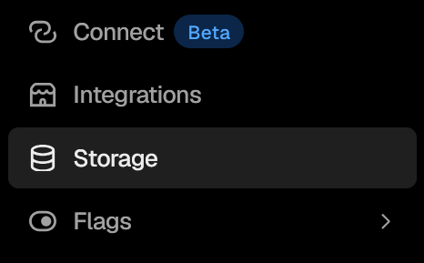
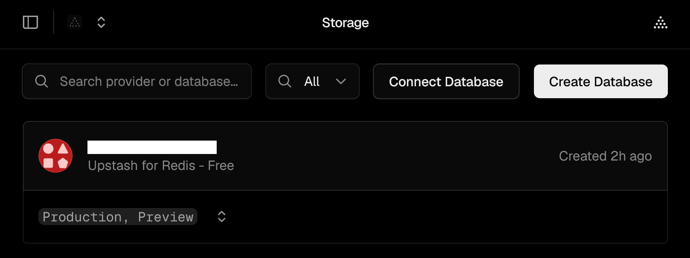
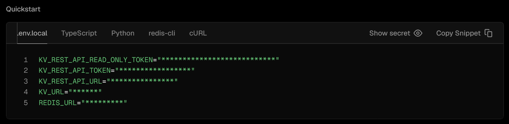

<p align="center">
	<br><strong>HyperOTP</strong><br>Email OTPs made simple.<br><br><a href="https://vercel.com/new/clone?repository-url=https%3A%2F%2Fgithub.com%2FShadowShahriar%2Fotp&env=EMAIL_USER,EMAIL_PASS&envDefaults=%7B%22EMAIL_USER%22%3A%22your-email%40gmail.com%22%2C%22EMAIL_PASS%22%3A%22abcd%20efgh%20ijkl%20mnop%22%7D"></a>
</p>

---

## About

**HyperOTP** is a simple OTP generation and verification service that sends security PINs to clients upon request. It uses Vercel Serverless Functions and [**Nodemailer**](https://www.npmjs.com/package/nodemailer) under the hood. This project was built on a whim while I was searching for reliable methods to generate OTPs for our mobile app development project in the third year.

I'd like to think that this project serves as a proof of concept that services like this can be implemented with a little experimentation and problem-solving.

## Installation

Run the following command to install the required NPM dependencies.

```bash
npm i
```

This will install the following dependencies:

1. [**`Express`**](https://expressjs.com/)

    > A minimal and flexible Node.js web application framework that provides a robust set of features for web and mobile applications.

2. [**`Nodemailer`**](https://nodemailer.com/)

    > The most popular email sending library for Node.js, making sending emails straightforward and secure, with zero runtime dependencies to manage.

3. [**`@vercel/kv`**](https://vercel.com/changelog/vercel-kv)
    > Allows us to save and read data quickly from serverless and edge functions.

Additionally, during testing, the [**`dotenv`**](https://www.npmjs.com/package/dotenv) package is also installed as a development dependency.

## Credentials

Since **HyperOTP** uses Nodemailer under the hood, it requires an SMTP configuration. Luckily, we can make use of one of our old Gmail accounts for testing. We might replace it with an actual mail service or use a custom domain (But that's beyond our scope right now.)

### Obtaining the App Password

> An app password is a 16-digit code used to let third-party apps or devices sign in to your email account when they do not support standard two-step verification.

We are using an App Password to access our Gmail account and send emails.

> [!CAUTION] We need to turn on **2-Step Verification** on the Google account before we can create an App Password.

Here is how we can create an App Password:

1. Go to the [**Google Account Security Page**](https://myaccount.google.com/security).
2. Turn on **2-Step Verification** if it is off.
3. Go to the [**App Password Page**](https://myaccount.google.com/apppasswords).
4. Type a name for the app (like "HyperOTPTest").
5. Click **Create** and copy the 16-digit code (`abcd efgh ijkl mnop` format) shown on your screen.
6. Take note of the 16-digit code and the email that we are using.
7. Open the `.env-sample` file and type the email address and the 16-digit code as shown below:

    ```env
    # === Gmail SMTP Credentials ===
    EMAIL_USER=your-email@gmail.com
    EMAIL_PASS=abcd efgh ijkl mnop
    ```

### Obtaining the KV Credentials

We need to store the user's email and OTP somewhere secure for a short time frame, we can do this using a Redis database. Vercel integrates nicely with **Upstash**.

1. Deploy the project by clicking on the button below.

    <a href="https://vercel.com/new/clone?repository-url=https%3A%2F%2Fgithub.com%2FShadowShahriar%2Fotp&env=EMAIL_USER,EMAIL_PASS&envDefaults=%7B%22EMAIL_USER%22%3A%22your-email%40gmail.com%22%2C%22EMAIL_PASS%22%3A%22abcd%20efgh%20ijkl%20mnop%22%7D"></a>

2. Fill out the SMTP credentials from the [**previous step**](#obtaining-the-app-password).

3. Go to the project's dashboard and click on **Storage** from the sidebar.

    

4. Create an **Uptash for Redis** database by clicking the **Create Database** button.

    

5. Upon creation, we will need to connect this database to our project. We can do that by clicking the **Connect Database** button.

6. Click on the database icon. This will navigate us to the guide page.

    

7. Copy the credentials using the **Copy Snippet** button and paste them to the `.env-sample` file:

    ```env
    # === Vercel KV REST Credentials ===
    KV_REST_API_READ_ONLY_TOKEN=
    KV_REST_API_TOKEN=
    KV_REST_API_URL=
    KV_URL=
    REDIS_URL=
    ```

8. Finally, rename the `.env-sample` file to `.env`

## Testing

We will need two terminals to test the service.

1. In the first terminal, run the following command. This will initiate our Express server.

    ```bash
    node api/index.js
    ```

2. In the second terminal, run the command given below. This will simulate the OTP life-cycle.

    ```bash
    node test.js
    ```

## License

- The source code of this repository is licensed under the [**MIT License**](https://github.com/ShadowShahriar/otp/blob/main/LICENSE).
- Project icon was sourced from [**Streamline Icons**](https://streamlinehq.com).
